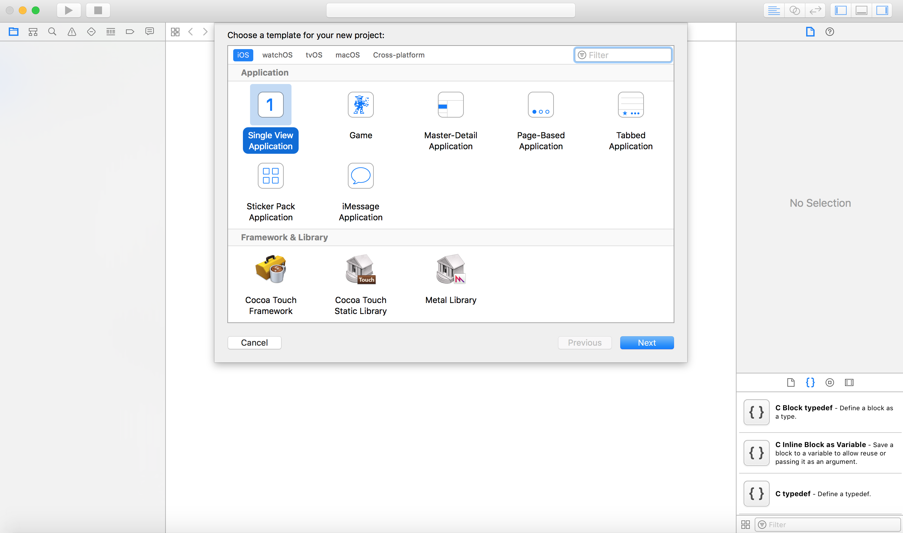

Aujourd’hui nous allons voir comment faire des push notifications sur ios à partir d’Amazon SNS.

*Prérequis*:
* Avoir un compte Apple développeur
* Avoir un compte Amazon

Je vous préviens la phase théorique est longue mais nécessaire afin que vous comprenez bien la logique derrière tout ça (Personnellement je préfère tout voir au lieux d’apprendre bêtement quelque chose).

# Sommaire
* [Qu’est ce que les push notifications ?](#qu-est-ce-que-le-push-notifications-?)
* [APNs](#apns)
* [Application](#Application)


# Qu’est ce que les push notifications ?

Bon a part si votre téléphone est un 3310 (best phone ever <3 ) vous avez obligatoirement eu l’occasion de recevoir une notification de la part d’une application. Aujourd’hui cette fonctionnalité est très utilisé par la plupart des applications, donc il est “indispensable” de savoir comment cela marche et comment la mettre en place. Rassurez-vous nous allons voir tout ça ensemble.

Il existe deux types de push notifications:
1. **Locale** : Votre application configure les détails de notifications localement et transmet ses informations au système qui gère la livraison de la notification lorsque celle-ci n’est pas au premier plan (foreground).
2. **Remote** (distante) : Avec les notifications à distance, vous utilisez l’un de vos serveur pour envoyer les données à vos utilisateurs via le service Apple Push Notification (APNs).

Pour l'utilisateur, il n'y a pas de différence entre une notification locale et une notification à distance. Les deux types de notifications ont la même apparence par défaut.


Vous pouvez personnaliser l'apparence dans certains cas, mais surtout vous choisissez comment vous souhaitez que l'utilisateur soit informé. Plus précisément, vous choisissez l'une des options suivantes pour la livraison de la notification:
* Une alerte ou une bannière sur écran
* Un badge sur l'icône de votre application
* Un son qui accompagne une alerte, une bannière ou un badge

Il faut toujours utiliser les notifications locales et à distance judicieusement pour éviter d'agacer l'utilisateur. Le système permet aux utilisateurs d'activer et de désactiver la présentation des alertes, des sons et des badges par application.

Bien que les notifications puissent toujours être envoyées à votre application, le système notifie l'utilisateur uniquement aux options actuellement activées. Si l'utilisateur désactive complètement les notifications, les APNs ne fournissent pas les notifications de votre application sur le périphérique de l'utilisateur et la programmation des notifications locales échoue toujours.

# APNs

Apple nous indique qu’il s'agit d'un service robuste, sécurisé et hautement efficace pour les développeurs afin de propager des informations aux périphériques iOS.

Lors du lancement initial de votre application sur l’iphone d'un utilisateur, le système établit automatiquement une connexion IP accréditée, chiffrée et persistante entre votre application et l’APNs. Cette connexion permet à votre application d'effectuer une configuration pour lui permettre de recevoir des notifications.

L'autre partie de la connexion permet l'envoi de notifications. Le “canal” persistant et sécurisé entre un serveur provider et les APNs nécessite une configuration dans votre compte de développeur en ligne et l'utilisation de certificats cryptographiques fournis par Apple. Un serveur provider est un serveur que vous déployez, gérez et configurez pour fonctionner avec les APNs.


1. Votre provider peut envoyer des demandes de notification aux APNs.
2. Les APNs transmettent les payloads de notification correspondants à chaque périphérique ciblé.
3. À la réception d'une notification, le système fournit le payload à l'application appropriée sur l'appareil et gère les interactions avec l'utilisateur.

Si une notification arrive et que l'appareil est sous tension mais que l'application ne fonctionne pas, le système peut toujours afficher la notification.
Si l'appareil est éteint lorsque les APNs envoient une notification, les APNs retiennent la notification et tentent de la renvoyer plus tard.

Votre provider à les responsabilités suivantes pour échanger avec les APNs :

* Recevoir via l’APNs, des tokens uniques et spécifiques par device ainsi que d’autres données pertinentes provenant des instances de votre application sur les devices utilisateurs.
* Déterminer, selon la conception de votre système de notification lorsque des notifications à distance doivent être envoyées à chaque appareil.
* Création et envoi de demandes de notification aux APNs. Chaque demande contient un payload et des informations de livraison. Les APNs fournissent ensuite les notifications correspondantes aux appareils visés en votre nom.

Bien évidemment vous pouvez avoir plusieurs providers


Vous l’avez vite compris c’est un sujet vaste et complexe. Rassurez vous il existe énormément de service qui vous facilite énormément la vie concernant la partie provider.

Voici une petite liste non exhaustive des services les plus répandus :
* Firebase (Gratuit)
* Amazon Simple Notification Service - SNS (0,50 USD par million)
* Urbanairship
* Twilio
* ...

Dans notre article nous allons utiliser Amazon SNS. Amazon propose des services très utilisés par les devops afin, pour la plupart du temps, créer l’architecture serveur de votre projet. C’est donc plus simple de centraliser tous vos services.

Avant de configurer Amazon, nous allons coder un peu l’application.

# Application

Votre application doit être configurée au moment du lancement pour prendre en charge les notifications distantes. Plus précisément, vous devez configurer votre application à l'avance s'il fait l'une des opérations suivantes :
* Affiche les alertes, joué des sons ou badge d’icône en réponse à une notification d'arrivée.
* Affiche des boutons d'action personnalisés avec une notification.

Cela signifie que vous devez configurer votre support de notification au plus tard dans l’application via la méthode `didFinishLaunchingWithOptions` (`AppDelegate.swift`).

## Création et configuration de l’Application

Créez une “Single View Application” sous Xcode



Ensuite il va falloir activer les notifications de votre application. Pour faire ceci il suffit de cliquer dans la rubrique “Capabilities” et d’activer “Push notifications”, et pour finir dans “Background Modes”, checker “Remote notifications”.


**Rappel**:
Chaque fois que votre application se lance, elle doit s'inscrire auprès des APNs. Les méthodes à utiliser sont diffèrent selon la plate-forme, mais dans tous les cas, cela fonctionne comme ceci:
1. Votre application demande à être enregistrée auprès des APNs.
2. Lors d'une inscription réussie, l’APNs envoie un jeton de périphérique spécifique à l'appareil.
3. Le système délivre le device à votre application en appelant une méthode dans votre délégué d'application.
4. Votre application envoie le jeton du périphérique au fournisseur associé de l'application.

### Récupérer le token auprès des APNs.
Pour initialiser l’enregistrement auprès des APNs il suffit d’appeler la méthode `registerForRemoteNotifications` de l’objet UIApplication.
Appelez cette méthode au moment du lancement dans le cadre de votre séquence de démarrage normale. La première fois que votre application appelle cette méthode, l'objet de l'application contacte les APNs et demande le jeton du périphérique spécifique à l'application en votre nom.
Le système appelle de manière asynchrone l'une des deux méthodes de délégation d'application suivantes, selon le succès `didRegisterForRemoteNotificationsWithDeviceToken` ou l'échec `didFailToRegisterForRemoteNotificationsWithError`.
L’objet de l’application contacte les APNs uniquement lorsque le jeton du périphérique a changé. Si votre device token change pendant que votre application tourne l’objet de l’application appel la méthode `didRegisterForRemoteNotificationsWithDeviceToken`.

**Attention: CECI NE MARCHE PAS SUR SIMULATOR !!!!!!!!!**.
Veuillez brancher votre iphone pour tester votre code.

``` swift
import UserNotifications

//...

func application(_ application: UIApplication, didFinishLaunchingWithOptions launchOptions: [UIApplicationLaunchOptionsKey: Any]?) -> Bool {
    // Override point for customization after application launch.

    // Configure les interactions utilisateur
    self.configureUserInteractions()

    // Enregistrement avec les APNs
    UIApplication.shared.registerForRemoteNotifications() // L'objet application = UIApplication.shared (singleton)

    return true
}

// ...

func application(_ application: UIApplication, didRegisterForRemoteNotificationsWithDeviceToken deviceToken: Data) {
    // ...

    // Envoi le token vers votre serveur.
    print("\n\n /**** TOKEN DATA ***/ \(deviceToken) \n\n")

    let deviceTokenString = deviceToken.reduce("", {$0 + String(format: "%02X", $1)})
    print("\n\n /**** TOKEN STRING ***/ \(deviceTokenString) \n\n")
    self.forwardTokenToServer(token: deviceTokenString)
}

func application(_ application: UIApplication, didFailToRegisterForRemoteNotificationsWithError error: Error) {
    print("Error: \(error.localizedDescription)")
}

func application(_ application: UIApplication, didReceiveRemoteNotification userInfo: [AnyHashable : Any]) {
    print(userInfo)
}

// ...

// MARK: Send Token to server
extension AppDelegate {
    func forwardTokenToServer(token: String) {
        // ...
    }
}

// MARK: User interactions
extension AppDelegate {
    func configureUserInteractions() {
        // iOS 10 support
        if #available(iOS 10, *) {
            UNUserNotificationCenter.current().requestAuthorization(options:[.badge, .alert, .sound]){ (granted, error) in }

            return
        }

        // iOS 9 support
        if #available(iOS 9, *) {
            UIApplication.shared.registerUserNotificationSettings(UIUserNotificationSettings(types: [.badge, .sound, .alert], categories: nil))

            return
        }

        // iOS 8 support
        UIApplication.shared.registerUserNotificationSettings(UIUserNotificationSettings(types: [.badge, .sound, .alert], categories: nil))
    }
}
```


Depuis IOS10, un nouveau framework appelé `UserNotifications` a été introduit et doit être importée au début afin d’avoir accès à la classe UNUserNotificationCenter.

Je me suis permis d’ajouter le code qui demande la permission à votre user de recevoir des notifications.

Lorsque votre application reçoit une push notification c’est par la méthode `didReceiveRemoteNotification`.

Notez que ce callback ne sera invoqué que lorsque l'utilisateur aura cliqué ou déplacé pour interagir avec votre notification push de l'écran de verrouillage / Centre de notification, ou si votre application était ouverte lorsque la notification par push a été reçue par le périphérique.

C'est à vous de développer la logique réelle qui s'exécute lorsqu'une notification est interagit. Par exemple, si vous avez une application messenger, une notification push "nouveau message" doit ouvrir la page de discussion pertinente et faire apparaître la liste des messages à partir du serveur. Utilisez userInfo qui contiendra toute donnée que vous envoyez à partir de votre backend d'application, tel que l'ID de chat, dans l'exemple de messagerie.

# Création d'un client ssl universel pour le push notification
